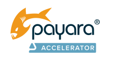

# Speed Lives
        
<!DOCTYPE html>
<!--
Click nbfs://nbhost/SystemFileSystem/Templates/Licenses/license-default.txt to change this license
Click nbfs://nbhost/SystemFileSystem/Templates/JSP_Servlet/Html.html to edit this template
-->
<html><head>
<meta http-equiv="content-type" content="text/html; charset=UTF-8">
        <meta charset="UTF-8">
        <meta name="viewport" content="width=device-width, initial-scale=1.0">
    </head>
    <body>
        

            <!-- long images include -->
        

        

            
The Payara® Platform - Production-Ready,
                Cloud Native and Aggressively Compatible.
                <b style="color: orange; font-size: 18px;">Datasheet</b>

        

        

            

                <!-- enter payara -->
            

Payara® Accelerator Services: Migrate to Cloud

        

    

    

        <h2>Introduction</h2>
    

    

        <table boder="0" width="100%" height="100%">
            <tbody><tr>
                <td width="50%">
                    
The Payara Platform offers Java-based application server
                        runtimes that are cloud-native and optimized for production
                        environments. They can be deployed in any environment: on
                        cloud, on-premises, or hybrid. Payara Platform’s cloud-native
                        features and best practices can help you make a smooth
                        transition to the cloud, taking full advantage of the scalability,
                        flexibility, and cost-efficiency that cloud environments offer.

                    <h2 style="color: orange">Payara Platform environments running
                        on traditional on-premises servers</h2>
                    
The Payara Accelerator Cloud Migration Service facilitates
                        the shift of your Payara Platform workloads from on-premises
                        servers to the cloud, ensuring you leverage Payara Platform’s
                        full capabilities for a successful move to your chosen
                        cloud environment.

                    
Our mission is to streamline your cloud migration and
                        modernization process, delivering a secure, cost-effective
                        transition with increased agility and resilience.

                    <h2 style="color: orange">The Payara Accelerator Upgrade Method</h2>
                    
Our cloud migration process is tailored to your specific needs
                        and begins with a comprehensive discovery consultation.
                        Our team collaborates with you to evaluate your application
                        architecture, infrastructure, and business objectives, setting
                        the stage for a bespoke cloud migration plan that aligns with
                        your goals.

                    <h4 style="color: gray">Our service includes:</h4>
                    

                        • Assessing your cloud infrastructure options. 
                        • Configuring and setting up the cloud environment. 
                        • Provisioning and installing the Payara Platform in
                        the cloud. 
                        • Migrating applications and configuring dependencies. 
                        • Configuring Payara for high availability and
                        optimal performance. 
                        • Documenting the cloud setup and providing
                        hands-on training. 
                        • Ongoing monitoring and optimization for improvement. 

                </td>
                <td width="50%">
                    <h2 style="color: orange">What is Payara Accelerator?</h2>
                    
Available exclusively to Payara
                        Enterprise customers, Payara
                        Accelerator is a suite of services
                        designed to optimize your
                        Payara Enterprise deployment,
                        migration, or business growth,
                        through customized infrastructure
                        improvements and solutions.

                    
See the full range of services we off <a href="https://www.payara.fish/page/payara-enterprise-downloads/">here.</a>

                    <h2 style="color: orange">Why Payara Enterprise?</h2>
                    
Payara Enterprise is the best
                        application platform for mission
                        critical Jakarta EE (Java EE) and
                        MicroProfile production systems.

                    
Payara Server Enterprise supports
                        reliable and secure deployments
                        of Jakarta EE applications in any
                        environment: on-premise, in the
                        cloud, or hybrid.

                    
Payara Micro Enterprise is the
                        platform of choice for containerized
                        Jakarta EE and MicroProfile
                        microservices deployments. It
                        provides a high performance and
                        highly scalable platform built
                        from the ground up for cloud
                        and containers.

                    
With Payara Enterprise, benefit from
                        support direct from our Engineers,
                        a 10 Year Software Lifecycle,
                        guaranteed monthly releases, bug
                        fixes, and patches, <a href="https://www.payara.fish/enterprise/">and more.</a>

                    
Our customers include US Coast
                        Guard, Rakuten Card, Hermes, DPD,
                        Fujitsu UK and BMW Group.

                    
Try Payara Enterprise for free <a href="http://localhost/SpeedLives/brochure.html">here.</a>

                </td>
            </tr>
        </tbody></table>
    

    

        <!-- enter payara -->
        
Payara® Accelerator Services: Migrate to Cloud

    

    

        <h2 style="color: orange">Outcomes</h2>
        
Payara Accelerator is committed to a smooth and efficient transition of your applications to a
            cloud-based environment. Our comprehensive process ensures your team is equipped with an
            understanding of the tools and strategies used from planning to execution. The result is a cloud-
            migrated environment that enhances the performance, scalability, and security of your applications.

        <h2 style="color: orange">How Do I Get Started?</h2>
        

            Due to the bespoke nature of our services, contact us for more
            information and we’ll create a custom package to suit you.
            &nbsp;&nbsp;&nbsp;&nbsp;&nbsp;&nbsp;&nbsp; <a href="https://www.payara.fish/about/contact-us/"><!-- contact --></a>
        

        <h2 style="color: orange">About Payara Services</h2>
        
We are a dedicated team of professionals devoted to open source, Java, Jakarta EE and MicroProfile.

        
As Contributing Members of the Eclipse Foundation, we invest our resources and expertise to improve,
            innovate and develop open source technologies. We are involved in shaping the future of the indus-
            try via our direct contributions to Jakarta EE (Payara’s Founder and CEO, Steve Millidge, is a Project
            Management Committee member) and MicroProfile.

    

    

        <table border="0" width="100%" height="100%">
            <tbody><tr>
                <td width="30%">
                    
                </td>
                <td width="30%">
                    
                </td>
                    <td width="30%">
                    
                </td>                    
            </tr>
        </tbody></table>
        

            
Payara Services Ltd 2023 All Rights Reserved. Registered in England and Wales; Registration Number 09998946
                Registered Office: Malvern Hills Science Park, Geraldine Road, Malvern, United Kingdom, WR14 3SZ

        

    

</body></html>
